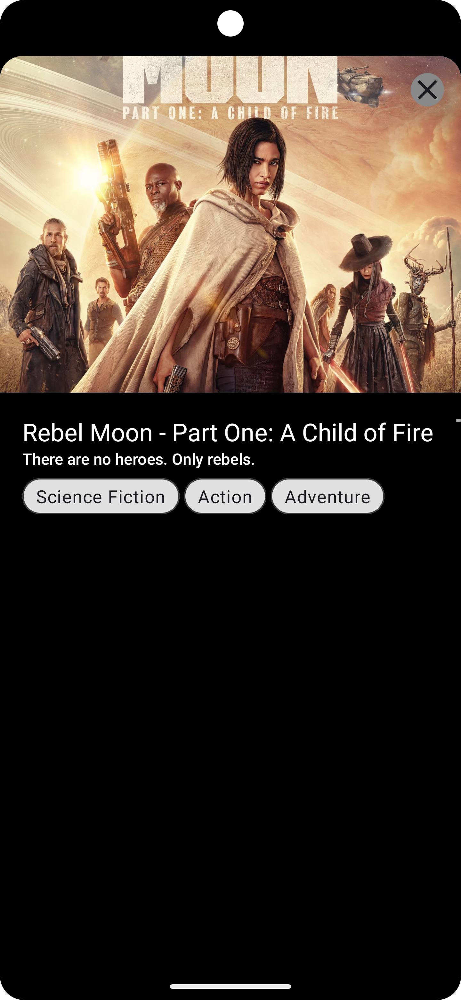

# TenFlix

### Ongoing Project 

Texflix is an ongoing project as a clone of Netflix. It is built in Compose and follows Clean architecture and MVVM, use case pattern. 
It uses the free available API of [themoviedb](https://www.themoviedb.org/)

### Supported Platforms: 
* Android

### Video Demo
https://github.com/Usama-Aman/TenFlix/assets/30404628/98dba4d8-9d35-4beb-b00d-945d71187fc0

### Screenshots
 

